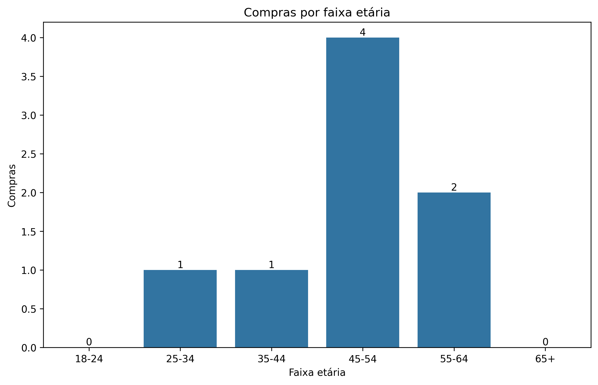
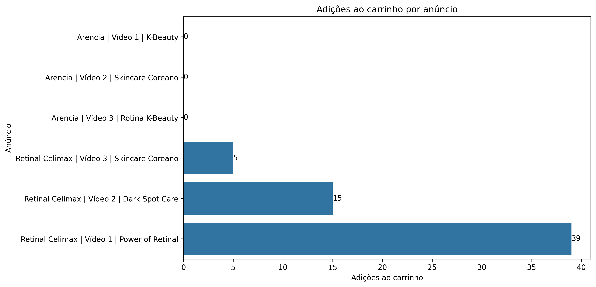

# Meta Ads Campaign Performance Analysis

## Project Overview

This project analyzes the performance of Meta Ads campaigns for an e-commerce business using real campaign data exported from Meta Ads.

The goal is to understand which audience segments and ads generated the strongest results, turning campaign data into actionable marketing insights.

The analysis focuses on:

- Age group performance
- Ad performance
- Click behavior
- Add-to-cart behavior
- Purchase conversion
- Cost efficiency

---

## Business Questions

This project answers the following questions:

1. Which age group generated the most link clicks?
2. Which age group generated the most add-to-cart events?
3. Which age group had the highest add-to-cart rate?
4. Which ad generated the most link clicks?
5. Which ad generated the most add-to-cart events?
6. Which ad had the highest add-to-cart rate?
7. Which ad performed best overall considering engagement, conversions and costs?

---

## Tools Used

- Python
- Pandas
- NumPy
- Matplotlib
- Seaborn
- Jupyter Notebook / Google Colab

---

## Dataset

The dataset was exported from Meta Ads and contains campaign performance data segmented by age group and gender.

Main metrics analyzed include:

- Impressions
- Link clicks
- Add-to-cart events
- Purchases
- Ad spend
- CTR
- Link CPC
- Add-to-cart rate
- Cost per add-to-cart
- Cost per purchase

The raw dataset is not included in this repository because it contains real business campaign data.

---

## Key Findings

### Audience Performance

The **35–44 age group** showed the strongest performance in the upper and middle parts of the conversion funnel.

- 228 link clicks
- 25 add-to-cart events
- Approximately 11.0% add-to-cart rate

The **45–54 age group** generated the highest number of purchases, accounting for **4 out of 8 total purchases**.

The **55–64** and **65+** groups showed relatively high CTRs, although this engagement did not translate proportionally into purchases.

  

---

### Ad Performance

The best overall performing ad was:

**Retinal Celimax | Video 1 | Power of Retinal**

Results:

- 441 link clicks
- 39 add-to-cart events
- 7 purchases
- Approximately 87.5% of all purchases
- Link CPC: approximately CHF 0.45
- Cost per add-to-cart: approximately CHF 5.05
- Cost per purchase: approximately CHF 28.14

The ad **Retinal Celimax | Video 2 | Dark Spot Care** achieved the highest link CTR, but showed lower efficiency further down the funnel.

The ad **Retinal Celimax | Video 3 | Skincare Coreano** achieved the highest add-to-cart rate, at approximately 10.2%, but with a lower traffic volume and no recorded purchases.

  

---

## Recommendations

Based on the analysis:

- Prioritize audiences between **35 and 54 years old**
- Continue monitoring the **55–64** age group
- Gradually increase investment in the **Power of Retinal** creative
- Continue testing the **Skincare Coreano** creative due to its strong add-to-cart rate
- Reevaluate the **Dark Spot Care** creative due to its higher cost per purchase
- Run future A/B tests under more comparable delivery and budget conditions
- Collect a longer period of data before making major budget decisions
- Include purchase value in future exports to calculate **ROAS**

---

## Limitations

The analysis includes only **8 purchases**, so purchase-level findings should be considered preliminary.

The ads also received different levels of exposure and budget allocation, which limits direct creative comparisons.

Purchase revenue was not available in the dataset, so ROAS could not be calculated.

---

## Conclusion

The analysis identified clear differences in both audience and ad performance.

The **35–44 age group** demonstrated the strongest engagement and purchase intent, while the **45–54 age group** generated the highest number of completed purchases.

Among the ads, **Power of Retinal** showed the strongest overall performance by combining high traffic volume, conversions and cost efficiency.

This project demonstrates how campaign data can be transformed into practical insights to support marketing decisions and budget allocation.

---

## Notebook

You can view the full analysis here:

[Open the notebook](./meta_ads_analysis.ipynb)
